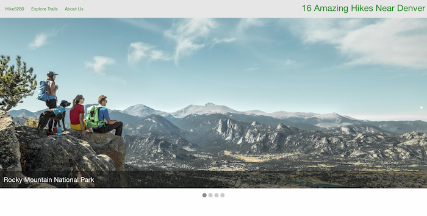
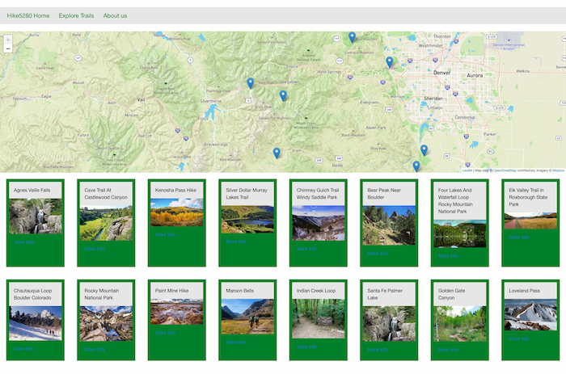
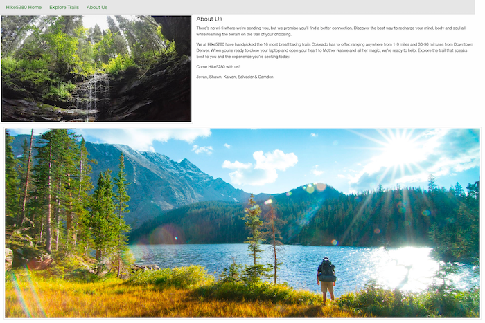

# Project-1-Trail-Finder

## Project Title

Hike5280

## Team Members 

- Jovan Nixon (https://github.com/jmnfire)
- Camden Whirl (https://github.com/CWhirl)
- Kaivon Tolooee (https://github.com/kaivont85)
- Shawn Paulsen (https://github.com/spaulsen-creator/)
- Salvador Farias (https://github.com/sfarias17)

## Project Description 

A simple website created for users who want to hike around Denver featuring 16 different hikes.  When the user clicks on a certain hike, the users will be able to see the location on the map provided and given a link for more information on that specific hike.  If the user navigates to another page, the last hike searched will be saved on the map if the user returns to search for more hikes. 

## APIs Used 
- Leaflet 
- MapBox

## Features

- JavaScript
- jQuery
- Local Storage
- HTML 
- CSS
- Foundation 
- Third-party APIs

## Installation 

NO installation required you can view the page. If you want to look at our code, do a git clone or our repository. 

[Link to website](https://cwhirl.github.io/trail-finder/)

## Usage

## Credits 

- https://dayhikesneardenver.com/
- https://get.foundation/index.html

## License 

MIT License
Copyright (c) 2021 Jovan Nixon
Permission is hereby granted, free of charge, to any person obtaining a copy
of this software and associated documentation files (the "Software"), to deal
in the Software without restriction, including without limitation the rights
to use, copy, modify, merge, publish, distribute, sublicense, and/or sell
copies of the Software, and to permit persons to whom the Software is
furnished to do so, subject to the following conditions:
The above copyright notice and this permission notice shall be included in all
copies or substantial portions of the Software.
THE SOFTWARE IS PROVIDED "AS IS", WITHOUT WARRANTY OF ANY KIND, EXPRESS OR
IMPLIED, INCLUDING BUT NOT LIMITED TO THE WARRANTIES OF MERCHANTABILITY,
FITNESS FOR A PARTICULAR PURPOSE AND NONINFRINGEMENT. IN NO EVENT SHALL THE
AUTHORS OR COPYRIGHT HOLDERS BE LIABLE FOR ANY CLAIM, DAMAGES OR OTHER
LIABILITY, WHETHER IN AN ACTION OF CONTRACT, TORT OR OTHERWISE, ARISING FROM,
OUT OF OR IN CONNECTION WITH THE SOFTWARE OR THE USE OR OTHER DEALINGS IN THE
SOFTWARE.

## Badges

